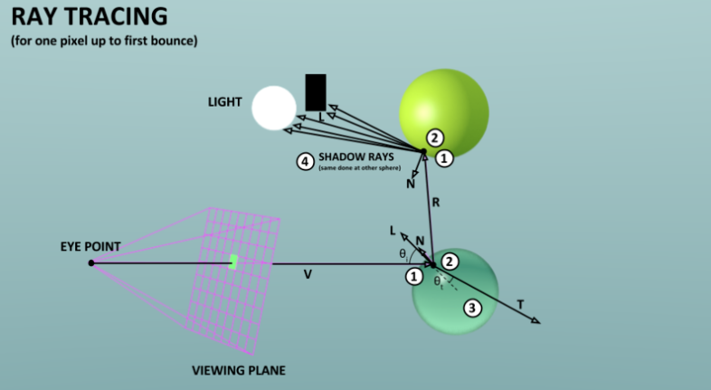

# Study Note
## Foreword
- What is RayTrace? -> If you dont know, go scearch pls.
<figure>
  
  <figcaption><b>Figure:</b>Diagram of a single ray in ray tracing</figcaption>
</figure>

- This project uses the following coordinate system convention:

| Axis     | Direction (English) | Notes              |
|----------|---------------------|--------------------|
| X        | Right (+)           | Horizontal axis    |
| Y        | Up (+)              | Vertical axis      |
| Z        | Into screen (-)     | Depth (camera view)|
<figure>
  
  <figcaption><b>Figure:</b> Axis</figcaption>
</figure>

- using `vector<vec3> framebuffer(width * height)`to store pixios
- For ray algorithm and corresponding material parameters, watch my other note
  -> [watch here](assets/algorithm&material.pdf)
## sphere.c

- framebuffer is a 1dim array of Vec3f values, give us (r,g,b) values for each pixel. 

- How to know a intersect between ray and sphere?
  -> [watch here](http://www.lighthouse3d.com/tutorials/maths/ray-sphere-intersection/)

<figure>
  
  <figcaption><b>Figure:</b> ray_sphere_intersect() in <code>sphere.h</code></figcaption>
</figure>

---
## render.c
- How to Calculate reflection vector?
  -> [watch here(ch)](https://zhuanlan.zhihu.com/p/555451478)
- Calculate refraction vector using Snell's law?
  -> [watch here](https://byjus.com/physics/law-refraction-snells-law/)

---
## background.c
- Purpose of the `sample(const vec3& dir)` Function

Projecting the direction vector dir onto a sphere, mapping that spherical direction to 2D coordinates (u, v), and then sampling the corresponding pixel from an environment texture.

ch version -> [watch here](assets/sample函数说明.pdf)

jp version -> [watch here](assets/sample()の説明.pdf)

*Maintained by: Mrjowj*