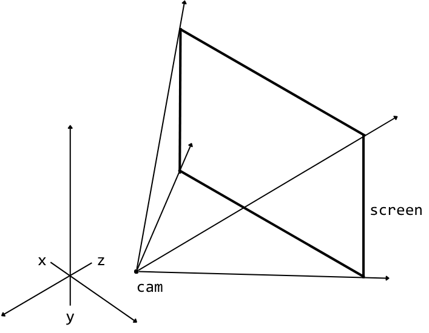
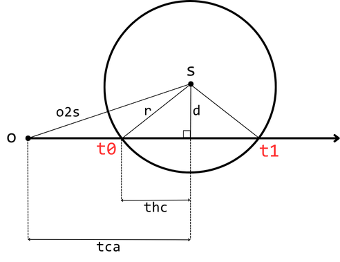

# MyRaytracer Project

This project is based on the [TinyRaytracer Wiki by ssloy](https://github.com/ssloy/tinyraytracer/wiki), which I’m using as a learning reference.

# Project Goals

- **Refresh my C++ skills**: I haven't used C++ for over a year, so this project serves as a hands-on way to recover my coding proficiency.
  
- **Inprove my English Skill**: All code/Study Note will be commented in English to improve technical writing skills and prepare for future global collaboration.

- **Supplementary notes**: Due to my current English level, some complex concepts may include brief Chinese notes(Or Japanese) for self-reference.

---
# Study Note
## Foreword
| Axis     | Direction (English) | Notes              |
|----------|---------------------|--------------------|
| X        | Right (+)           | Horizontal axis    |
| Y        | Up (+)              | Vertical axis      |
| Z        | Into screen (-)     | Depth (camera view)|
<figure>
  
  <figcaption><b>Figure:</b> Axis</figcaption>
</figure>

- using `vector<vec3> framebuffer(width * height)`to store pixios
- For ray algorithm and corresponding material parameters
  -> [watch here](docs/algorithm&material.pdf)
## sphere.c

- framebuffer is a 1dim array of Vec3f values, give us (r,g,b) values for each pixel. 

- How to know a intersect between ray and sphere?
  -> [watch here](http://www.lighthouse3d.com/tutorials/maths/ray-sphere-intersection/)

<figure>
  
  <figcaption><b>Figure:</b> ray_sphere_intersect() in <code>sphere.h</code></figcaption>
</figure>

---
## render.c
- How to Calculate reflection vector?
  -> [watch here](https://zhuanlan.zhihu.com/p/555451478)
- Calculate refraction vector using Snell's law?
  -> [watch here](https://byjus.com/physics/law-refraction-snells-law/)

---

*Maintained by: Mrjowj*
